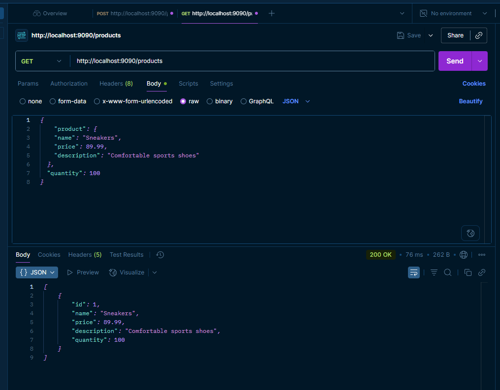

# 🛒 MicroInventorySystem-Product

#### [Microservice 1: Product Service](https://github.com/Ochwada/MicroInventorySystem-Product)
#### [Microservice 2: Inventory Service](https://github.com/Ochwada/MicroInventorySystem-Inventory)
#### [Microservice 3: Order Service](https://github.com/Ochwada/MicroInventorySystem-Order)
#### [Microservice 4: Notification Service](https://github.com/Ochwada/MicroInventorySystem-Notification)


## Microservice 1: Product Service - Overview

This is the **Product Service**, a core component in a microservices-based architecture designed to manage 
product-related data. It handles product creation, retrieval, and provides real-time stock availability by communicating 
with the external Inventory Service.

---

## 📦 Features

- Store and retrieve product details: ID, name, description, price
- Communicate with `Inventory Service` to check stock quantity
- RESTful API design with Spring Boot
- Clean architecture using DTOs and mappers
- Configurable service URL via application properties
- Validates input using Spring's bean validation
- Environment variable support via `.env` file using `dotenv-java`
- Database configuration via `application.properties`
- Docker support with PostgreSQL integration


## 🛠 Tech Stack
| Technology           | Purpose                                                            |
|----------------------|--------------------------------------------------------------------|
| **Java 17+**         | Primary programming language                                       |
| **Spring Boot**      | Rapid application development framework                            |
| **Spring Web (MVC)** | Build RESTful APIs, embedded Tomcat server                         |
| **Spring Data JPA**  | Database interaction using repositories and Hibernate ORM          |
| **PostgreSQL**       | Production-ready relational database                               |
| **H2**               | In-memory database (optional for development/test)                 |
| **Lombok**           | Reduces boilerplate (e.g., `@Getter`, `@Setter`, `@Builder`)       |
| **RestTemplate**     | Simplified HTTP client for inter-service communication             |
| **dotenv-java**      | Load `.env` configuration variables in Java                        |
| **Maven**            | Build tool and dependency manager                                  |
| **Docker Compose**   | Orchestrates microservices and PostgreSQL containers for local dev |

 

## 📁 Project Structure
```yaml
micro-inventory-system/
├── docker-compose.yml               # Root Docker Compose for the entire microservices system
├── .env                             # Global environment variables (Mongo URI, DB password, etc.)
├── README.md                        # Project documentation
│
├── product-service/                 # 🧩 Microservice 1: Product Service (Spring Boot + PostgreSQL)
│   ├── .mvn/
│   ├── src/
│   │   └── main/
│   │       ├── java/
│   │       │   └── com.ochwada.product/
│   │       │       ├── config/             # Spring configuration (e.g., RestTemplate bean)
│   │       │       ├── controller/         # REST controller layer
│   │       │       ├── dto/                # Data Transfer Objects
│   │       │       ├── mapper/             # Maps between entities and DTOs
│   │       │       ├── model/              # JPA entity classes
│   │       │       ├── repository/         # Spring Data JPA repositories
│   │       │       └── service/            # Business logic and inventory communication
│   │       │           ├── InventoryClient.java
│   │       │           └── ProductService.java
│   │       │           └── ProductServiceApplication.java
│   │       └── resources/
│   │           └── application.properties  # Configuration (port, inventory service URL, DB)
│   ├── pom.xml                             # Maven build file
│   ├── Dockerfile                          # Docker setup
│   ├── .env                                # Local environment variables (DB password, etc.)
│   ├── docker-compose.yml                  # (Optional) Microservice-specific Docker setup
│   └── README.md                           # Service-level documentation
│
├── inventory-service/             # 🧩 Microservice 2: Inventory Service (Spring Boot + MongoDB)
│   ├── Dockerfile
│   ├── pom.xml
│   ├── .env
│   └── src/

└── external-libraries/            # (Optional) Dependencies not managed via Maven


```
#### 🧩 Highlights:
- This structure clearly defines this as a Spring Boot microservice. 
- Organized by layer: config, controller, dto, mapper, model, repository, service. 
- Can be scaled or integrated with other services (e.g., inventory-service, order-service).

## 📡 API Endpoints

| Method | Endpoint                | Description         |
|--------|-------------------------|---------------------|
| GET    | `/products`             | Get all products    |
| GET    | `/products/{id}`        | Get product by ID   |
| GET    | `/products/name/{name}` | Get product by name |
| POST   | `/products`             | Add a new product   |

Example response:


```json
{
  "product": {
    "name": "Sneakers",
    "price": 89.99,
    "description": "Comfortable sports shoes"
  },
  "quantity": 100
}
```
## 🐳 Docker Integration
### 1. `docker-compose.yml`
The `docker-compose.yml` file can be used to spin up this microservice along with PostgreSQL:
```yaml


services:
  
  product-service:
    build:
      dockerfile: Dockerfile               # Dockerfile for building the Spring Boot app
    container_name: product-service
    ports:
      - "9090:9090"                        # Maps container port 9090 to host port 9090
    environment:
      SPRING_DATASOURCE_URL: jdbc:postgresql://products_db:5432/products  # DB connection URL
      SPRING_DATASOURCE_USERNAME: postgres                                 # DB username
      SPRING_DATASOURCE_PASSWORD: ${POSTGRES_PASSWORD}                           # Loaded from .env
    depends_on:
      - products_db                     # Ensure DB is ready before service starts
    networks:
      - backend                         # Use shared network for service discovery

  # -------------------------------------------
  products_db:
    image: postgres:15                  # Uses official PostgreSQL image
    container_name: products_db
    environment:
      POSTGRES_DB: products             # Database name
      POSTGRES_USER: postgres           # DB user
      POSTGRES_PASSWORD: ${POSTGRES_PASSWORD} # DB password (loaded from .env)
    ports:
      - "5433:5432"                     # Map container 5432 to host 5433
    networks:
      - backend                         # Shared network for inter-service communication

# -------------------------------------------
networks:
  backend:
    driver: bridge
```

### 2. `Dockerfile`
```yaml
  # ========================
  # 1. BUILD STAGE
  # ========================
FROM maven:3.9-eclipse-temurin-17-alpine AS build
WORKDIR /app

COPY pom.xml .
RUN mvn dependency:go-offline

COPY src ./src

RUN mvn clean package -DskipTests

  # ========================
  # 2. RUN STAGE
  # ========================

FROM eclipse-temurin:17-jdk-alpine
WORKDIR /app

COPY --from=build /app/target/*.jar app.jar

EXPOSE 9090

ENTRYPOINT ["java", "-jar", "app.jar"]
```